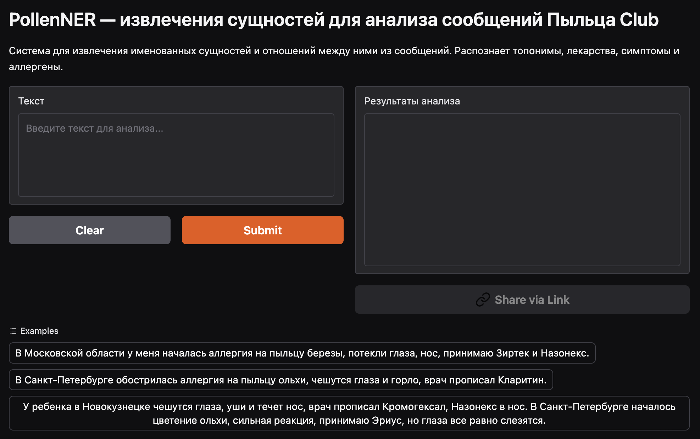

# 🌿 PollenNER+RE: Извлечение сущностей и отношений для Пыльца Club

[](https://www.python.org/) [](https://gradio.app/) [](https://huggingface.co/DanielNRU) [](LICENSE)

> **NLP-платформа для автоматического извлечения медицинских сущностей и их связей из пользовательских сообщений о пыльцевой аллергии**

---

<table>
<tr>
<td width="120"></td>
<td>
<b>Заказчик:</b> <a href="https://pollen.club/">Пыльца Club</a> — крупнейшее русскоязычное сообщество для людей с пыльцевой аллергией. Платформа помогает пользователям отслеживать риски, делиться опытом и получать актуальную информацию о состоянии воздуха.
</td>
</tr>
</table>

---

## 📋 Оглавление

* [О проекте](#-о-проекте)
* [Ключевые возможности](#-ключевые-возможности)
* [Архитектура и стек технологий](#-архитектура-и-стек-технологий)
* [Требования](#-требования)
* [Установка и запуск](#-установка-и-запуск)
* [Использование](#-использование)
* [Структура проекта](#-структура-проекта)
* [Контакты и поддержка](#-контакты-и-поддержка)

---

## 🔍 О проекте

PollenNER+RE — это система для автоматического извлечения из пользовательских сообщений ключевых сущностей и построения семантических связей между ними. Решает задачи:

1. **Распознавание сущностей**: топонимы, симптомы, препараты, аллергены.
2. **Классификация отношений**: определение связей между сущностями (например, "глаза has_symptom слезятся").
3. **Интеграция в реальный сервис**: автоматизация анализа сообщений для Пыльца Club.

---

## 🚀 Ключевые возможности

* 🏷️ **NER-модуль**: извлечение топонимов, симптомов, лекарств, аллергенов.
* 🔗 **RE-модуль**: построение связей между сущностями (например, симптом ↔ часть тела).
* 🤖 **Active Learning**: автоматический отбор наиболее информативных примеров для разметки.
* ⚡ **PEFT + LoRA**: эффективная дообучаемость моделей на небольших выборках.
* 📈 **Высокая точность**: F1-score NER = 0.91, RE = 0.93 на тестовой выборке.
* 🖥️ **Gradio-интерфейс**: удобный веб-интерфейс для тестирования и демонстрации.
* 📊 **Визуализация метрик**: отслеживание качества по мере увеличения датасета.


---

## 🏗 Архитектура и стек технологий

**Стек:** Python 3.8+, PyTorch, Transformers, Gradio, PEFT (LoRA), scikit-learn, pandas, numpy

| Компонент      | Технологии                                                      |
| -------------- | --------------------------------------------------------------- |
| NER-модуль     | ruBERT (DeepPavlov/rubert-base-cased) + LoRA                   |
| RE-модуль      | Sequence Classification (Transformers)                         |
| Интерфейс      | Gradio                                                          |
| Разметка       | Label Studio                                                    |
| Аналитика      | pandas, numpy, scikit-learn                                     |

---

## 📋 Требования

* Python >= 3.8
* torch >= 2.0.0
* transformers >= 4.51.3
* gradio >= 4.0.0
* peft >= 0.7.0
* numpy >= 1.24.0
* pandas >= 2.0.0
* scikit-learn >= 1.3.0
* evaluate >= 0.4.0

Все зависимости указаны в [`HFS/requirements.txt`](HFS/requirements.txt).

---

## ⚙️ Установка и запуск

1. Клонируйте репозиторий:

   ```bash
   git clone https://github.com/DanielNRU/PollenNER_RE.git
   cd PollenNER_RE/HFS
   ```

2. Установите зависимости:

   ```bash
   pip install -r requirements.txt
   ```

3. Запустите Gradio-интерфейс:

   ```bash
   python app.py
   ```

4. Откройте браузер и перейдите по адресу [http://localhost:7860](http://localhost:7860)

---



---

## 💡 Использование

1. Введите или вставьте текст сообщения пользователя (например:  
   `В Московской области у меня началась аллергия на пыльцу березы, потекли глаза, нос, принимаю Зиртек и Назонекс.`)
2. Нажмите **Submit**.
3. Получите:
   - Список найденных сущностей по категориям
   - Семантические связи между сущностями

---

## 📁 Структура проекта

```
PollenNER_RE/
├── HFS/                       # Gradio-интерфейс и основной код инференса
│   ├── app.py                 # Главный файл с Gradio-интерфейсом
│   ├── requirements.txt       # Python-зависимости
│   └── README.md              # Документация по интерфейсу
├── PollenNER_RE.ipynb         # Jupyter-ноутбук с пайплайном обучения и анализа
├── README.md                  # Документация по проекту
└── .gitignore                 # Исключения для git
```

---

## ✉️ Контакты и поддержка

**Автор:** Мельник Даниил  
* Email: [git@danieln.ru](mailto:git@danieln.ru)  
* GitHub: [DanielNRU](https://github.com/DanielNRU)  
* Hugging Face: [DanielNRU](https://huggingface.co/DanielNRU)

---